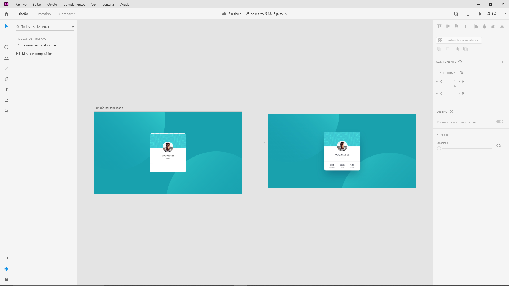
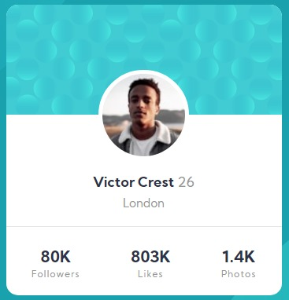

# Frontend Mentor - Profile card component solution

This is a solution to the [Profile card component challenge on Frontend Mentor](https://www.frontendmentor.io/challenges/profile-card-component-cfArpWshJ). Frontend Mentor challenges help you improve your coding skills by building realistic projects. 

## Table of contents

- [Overview](#overview)
  - [The challenge](#the-challenge)
  - [Screenshot](#screenshot)
  - [Links](#links)
- [My process](#my-process)
  - [Built with](#built-with)
  - [What I learned](#what-i-learned)
  - [Continued development](#continued-development)
  - [Useful resources](#useful-resources)
- [Author](#author)
- [Acknowledgments](#acknowledgments)

## Overview

### The challenge

- Build out the project to the designs provided

### Screenshot

Screenshot of the desktop page 1440px x 800px 


Screenshot of the desktop page 375px x 800px 

<p align="center">
  
</p>

### Links

- Live Site URL: [Live Site Here](https://profilecardcomponent-felipaodev.netlify.app/)

## My process

The process began with structuring all the content of the web page in plain text, from containers and their respective classes to be used in the style sheets.

Once all the content was structured, the visual structuring process was started from css. Starting with the positioning of the content which was centered, so from flexbox it was a very simple process.

To handle measures, make a previous layout within adobeXD so you had a basis for handling measures of each element such as the width and length of each component.

### Built with

- Semantic HTML5 markup
- CSS custom properties
- Flexbox

### What I learned

Within the development of this project I learned a better order for the development of web pages, taking into account the properties of the containers since some depend on the measures to function.

An example of this is the management of the funds of a container as was the case with this one since it requires the content of two images with a specific position to give it a solution, it was as follows:

```css
body{
  font-family: 'Kumbh Sans', sans-serif;
  background-color: hsl(185, 75%, 39%);
  background-image: url('../images/bg-pattern-top.svg'), url('..images/bg-pattern-bottom.svg');
  background-repeat: no-repeat, no-repeat;
  background-position: right 50vw bottom 50vh, left 50vw top 50vh;
}
```
In this way you can place two backgrounds at the same time and specify properties such as repetition and position within the container.

I was able to learn how to position elements thanks to flexbox, being a very easy way to be able to center elements such as in this case the user's profile, also to position the elements within the card.

<p align="center">
  
</p>

Finally, the small adjustments had to be made, such as the font size and the font handling of google fonts that was specified, and the handling of margins to be as similar as possible to the proposed challenge.

```css
.flex{
  display: flex;
  justify-content: center;
  align-items: center;
  height: 100vh;
}
```
<p align="center">
  
</p>


### Continued development

From this project I want to continue learning new strategies for the visual design of a web page and make use of JavaScript to make the page more dynamic.

### Useful resources

- [css-tricks](https://css-tricks.com/) - Within this page there are large sections related to learning css, the one I used the most was the FlexBox section. 

## Author

- Frontend Mentor - [@Felipao-Dev](https://www.frontendmentor.io/profile/Felipao-Dev)

- GitHub - [Felipao-Dev](https://github.com/Felipao-Dev)

## Acknowledgments

I want to thank a YouTube channel called [Bluuweb!](https://www.youtube.com/channel/UCH7IANkyEcsVW_y1IlpkamQ) which gave me many tips and advice for handling css and how to make the project from an image, I was very encouraged and learned many concepts and strategies for layout.
